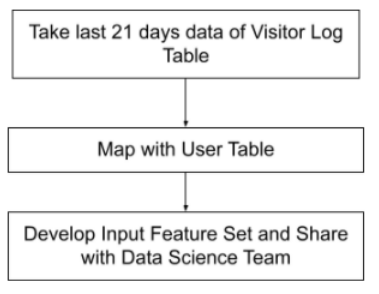

# JOB-A-THON - June 2021

This Project a part of JOB-A-THON conducted by the `Analytical Vidya`. More details can be found [here](https://datahack.analyticsvidhya.com/contest/job-a-thon-june-2021/)

## About

Data Engineering jobs are rapidly emerging amongst the hottest jobs in the analytics industry. Every organisation is looking for skilled and smart data engineers to help them clean the data, join the data, massage the data and build good quality data pipelines.

## Marketplace Feature Table

Your `Client ComZ` is an ecommerce company. The company wants to focus on targeting the right **customers** with the right products to increase overall revenue and conversion rate.

To target the right customers with the right products, they need to build an ML model for marketing based on user interaction with products in the past like number of views, most viewed product, number of activities of user, vintage of user and others.

`ComZ` has contacted the Data Science and Engineering team to use this information to fuel the personalized advertisements, email marketing campaigns, or special offers on the landing and category pages of the company's website.

You, being a part of the data engineering team, are expected to “**Develop input features**” for the efficient marketing model given the **Visitor log** data and **User** Data.

1. **Visitor Log Data** – It is a browsing log data of all the visitors and the users. This table contains the following information:

| WebClientID   | Unique ID of browser for every system. (If a visitor is using multiple browsers on a system like Chrome, Safari, then there would be a different web clientid for each browser). The ID remains consistent unless the user clears their cookie. |
| ------------- | ----------------------------------------------------------------------------------------------------------------------------------------------------------------------------------------------------------------------------------------------- |
| VisitDateTime | Date and time of visit. There are two different formats for DateTime. _ One is in datetime format “2018-05-07 04:28:45.970”_ Another one is in unix datetime format “1527051855673000000”                                                   |
| ProductID     | Unique ID of product browsed/ clicked by the visitor                                                                                                                                                                                            |
| UserID        | Unique ID of the registered user. As expected, this is available for registered users only, not for all visitors.                                                                                                                               |
| Activity      | Type of activity can be browsing (pageload) or clicking a product                                                                                                                                                                               |
| Browser       | Browser used by the visitor                                                                                                                                                                                                                     |
| OS            | Operating System of the system used by the visitor                                                                                                                                                                                              |
| City          | City of the visitor                                                                                                                                                                                                                             |
| Country       | Country of the visitor                                                                                                                                                                                                                          |

2. **User Data** – It has registered user information like signup date and segment.

| UserID       | Unique ID of the registered user.                           |
| ------------ | ----------------------------------------------------------- |
| Signup Date  | Date of registration for the user                           |
| User Segment | User Segment (A/B/C) created based on historical engagement |

Now based on the above two tables, you need to create an input feature set for the Marketing Model.

3. **Input Feature table**:

| UserID                        | Unique ID of the registered user                                                                                                                                                                                                                                         |
| ----------------------------- | ------------------------------------------------------------------------------------------------------------------------------------------------------------------------------------------------------------------------------------------------------------------------ |
| No_of_days_Visited_7_Days     | How many days a user was active on platform in the last 7 days.                                                                                                                                                                                                          |
| No_Of_Products_Viewed_15_Days | Number of Products viewed by the user in the last 15 days                                                                                                                                                                                                                |
| User_Vintage                  | Vintage (In Days) of the user as of today                                                                                                                                                                                                                                |
| Most_Viewed_product_15_Days   | Most frequently viewed (page loads) product by the user in the last 15 days. If there are multiple products that have a similar number of page loads then , consider the recent one. If a user has not viewed any product in the last 15 days then put it as Product101. |
| Most_Active_OS                | Most Frequently used OS by user.                                                                                                                                                                                                                                         |
| Recently_Viewed_Product       | Most recently viewed (page loads) product by the user.If a user has not viewed any product then put it as Product101.                                                                                                                                                    |
| Pageloads_last_7_days         | Count of Page loads in the last 7 days by the user                                                                                                                                                                                                                       |
| Clicks_last_7_days            | Count of Clicks in the last 7 days by the user                                                                                                                                                                                                                           |

**Process to create Input Feature:**

When ComZ does a targeting campaign, It follows the below process.

1. Filter the `VisitorLogData` data for last 21 days
2. Merge the `VisitorLogData` with `UserData`
3. Create the features from the merged data

In the current case, you are supposed to generate an input feature set as on 28-May-2018. So, the visitor table is from 07-May-2018 to 27-May-2018.

_As a Data Engineer Creating ETL Pipeline would definitely be appreciated and provide you the added advantage in interviews, Your effort should be to build _ _ETL\*\* _ _Pipeline such\*\* that passing the information of user data and log data, It can generate the input feature table automatically_

**How to make Submission:**

- Use Visitor Log Data and User Data to generate the features mentioned in the sample submission
- You are supposed to generate all the features for all the users as mentioned in the sample submission or input feature table
- Make sure your submission file’s rows (user ids) are in the same order as mentioned in the sample submission.
- All Submissions are to be done at the solution checker tab.
- For a step by step view on how to make a submission check the below video

**Things you should take into consideration:**

You are supposed to smartly clean and pre-process data like

- Imputing missing values effectively
- Handle different format of date time features
- Values stored in different case for the text information

**Evaluation Metric:**

- For continuous features, we will first calculate Mean Absolute Percentage Error (MAPE) for each continuous feature.

MAPE = Absolute Value (Derived Value - Actual Value)/ Actual Value

Then, we will calculate accuracy of Derived Value which is Mean Performance (MP)

> MP = (1 - MAPE)

- For categorical features, we will calculate Accuracy for each categorical feature.
- Accuracy = Percentage of value same in both derived feature and actual feature.
- Finally, we will take the weighted sum of MP and Accuracy for all features.

> Score = 1/8 ( MP(No_of_days_Visited_7_Days) + MP(No_Of_Products_Viewed_15_Days) + MP(User_Vintage)+ Accuracy(Most_Viewed_product_15_Days) + Accuracy(Most_Active_OS) + Accuracy(Recently_Viewed_Product) + MP(\*\*Pageloads_last_7_days) + MP(Clicks_last_7_days))

- Please note that scoring is going to be done using an automated script and difference in between the field names or order from the submission file format may result in zero scoring/error message due to the failure of the scoring script.
- Participants may do multiple submissions. They would have to select on the platform which one to be treated as the final submission. If not selected, the submission with the highest score would be considered as final.
- Only 5 submissions per day are allowed
- Final winners would be announced only after the submitted code reviews and the analysis of the rest of the document submissions made by the participants.
- Quality of code would be judged on the following parameters – functionality, reusability, modularity, documentation, testing and validation.
- Should be scalable to be executed on 10 GB data as well.

**Additional tips which might be helpful to solve this problem**

1. You can make the partial submission and use the descriptive statistics (mean for the continuous variable and mode for the categorical variable) for the unsolved part of the problem.
2. Generating values for categorical variables**(Most_Viewed_Product_15_Days, Most_Active_OS, Recently_Viewed_Product)** would provide a result above 0.6.
3. The userid is available for only those users who have registered with the platform. On the other hand, non-registered users are almost unknown to the platform. So you can start solving this problem primarily by focusing only on generating input feature tables for these registered users.
4. You can use the '**[to_datetime](http://r.newsletters.analyticsvidhya.com/mk/cl/f/Rb63W7TLPYCL1WEcYWdlqhJ9etKSw5x1r9yH3UnE7526dVNeHSbkB3IPQOrWYp9P9eMJRCv_h8lXprcXkwBitbTK3XGZ54g1Zme3xRPRzHuphXI-frdvmD5ARg7EX_z7vChkt69bNk0QY_F23u3hk--NURZcEJiKF3MnRkcqgzys1K5SgjylUtMvrBODsZPRi20BHuSR3WxIcyAwfDaGz6h7mKEvyfxP_K8PPNiWjJLlw9wdT7nef52ANW8tsNYzB4KiP4YPTmC2SKkdgedQZLbocPSwOpRAiSGqecPAj3lkJ7ySZBebeMDP3e6t7LdRRJMle6mUVLdDW8ape4yQnd8SH3wbohXOCn-5Iwpn3FxJO6w5wmNPFNkijGIKmHgHhTfrkqx-1E1g1C6lnzlOkFicxV_pR_jm_L8SNQ)**'**function of pandas to convert a series to DateTime datatype.**
5. **[&#39;.apply&#39;](http://r.newsletters.analyticsvidhya.com/mk/cl/f/_insBiY8zP1h9RPIVgUwNqg0fbipcShN6lUU1rnddAgFP1xzJZ9dS0B6dAAVzv1MIkUVtY8kRDy9Mhzug3kuKoE-TP3vmNerWFSVthEYpOQ18lkiUjZtaMFV-8bRAB8-BO4pPRTRv2qIv_za5VLbNcSEmMWY0M2eSe1wcq1_YX6R7z4dAPeKiF08HltRfLbGgrmhATDRugOyJ-UFHk6WMXDL1uzcR1rjaYcFr6hEhjGe-x_QJ1EYB5PmVVP7C-PpHB0INZXjp6AgE0dC58vs4lKN6ogOMWDTEbMcO6_kvZyRzGN0lE5gMlJyv5MyHIBafAG4iRaXW6azR6w7d1l7S81tstW6Ck5aFoUIKYDUArQpe-VDjo06gh-RU_j63-MHp9V28vOvERmgbh4RqDC1ws-Qab5ARq2jaoXvZ10ZnbE)** is the better and quicker way to apply a function on a large dataframe.
6. Number of products viewed by the user on a website means the**number of unique products the user has seen.**

**LeaderBoardScore:** `0.89849765337401`
